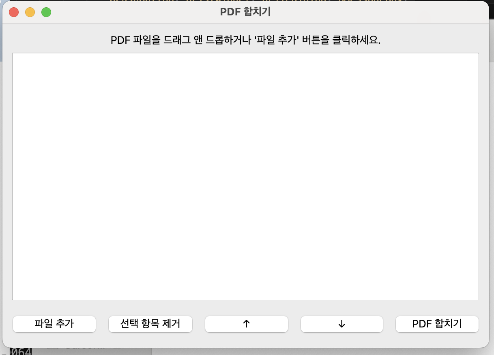

# 📄 PDF Merger - PDF 파일 합치기 프로그램 (PyQt6 기반 GUI)

간편하고 직관적인 PDF 병합 프로그램입니다 :)  
드래그 앤 드롭으로 PDF 파일을 추가하고, 순서를 조정한 뒤 버튼 한 번으로 PDF를 하나로 합칠 수 있어요!

---

## 📷 프로그램 화면



---

## ✅ 주요 기능

- PDF 파일 **드래그 앤 드롭 추가**
- PDF 순서 **자유롭게 변경 (↑ ↓ 버튼)**
- **선택한 항목 삭제**
- PDF 파일 **하나로 병합 후 저장**

---

## 🖥 실행 방법

### 방법 1. macOS 앱 사용하기

> `.app` 파일을 다운받아 실행하면 됩니다.

- [⬇️ macOS용 `.app` 다운로드](hhttps://minheestory.tistory.com)
블로그에서 다운로드 가능합니다.

### 방법 2. Python 코드 직접 실행

1. Python 설치 (3.9 이상 추천)
2. 아래 명령어로 필요한 패키지 설치:

```bash
pip install PyQt6 PyPDF2
python merge_pdf_gui.py
```markdown

---

## 📁 프로젝트 구조

merge_PDF/
├── merge_pdf_gui.py       # 메인 실행 파일
├── README.md              # 설명 문서
├── screenshot.png         # 프로그램 화면


---

## 🙋 만든 사람

작성자: Minhee Park
블로그: minheestory.tistory.com

---

## ☕ 응원하기

이 앱이 도움이 되셨다면
블로그 오셔서 댓글 남겨주시면 큰 힘이 됩니다 💖

---

## 🔗 라이선스

MIT License


